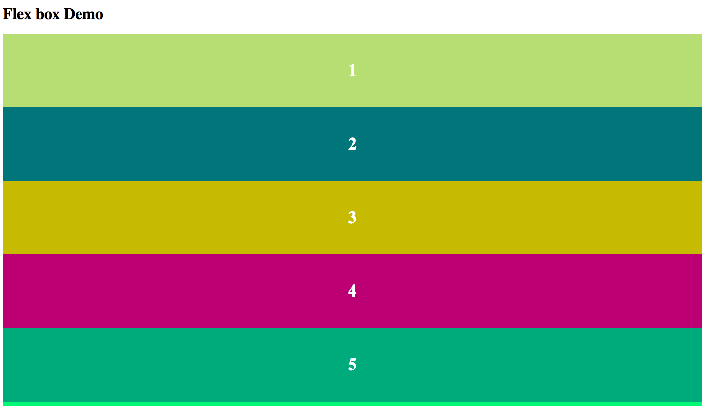
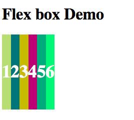
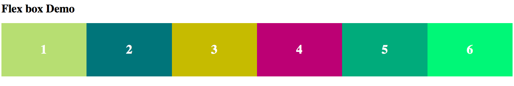
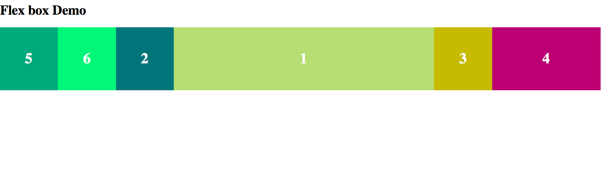
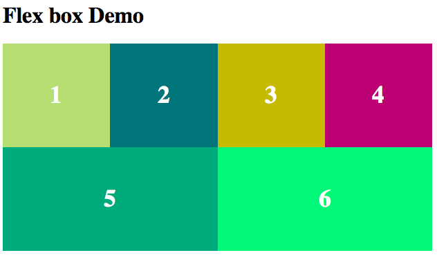

# flex box basic demo 
## 0. start code and output
```
<!--index.html-->
<!DOCTYPE html>
<html>

<head>
    <title>Demo 01</title>
    <meta charset="utf-8">
    <meta name="keywords" content="flex, flex-grow, order, flex-direction, flex-wrap, justify-content, align-items, align-self">
    <link rel="stylesheet" href="styles.css">
</head>

<body>
    <h1>Flex box Demo</h1>
    <div id="container">
        <ul id="flex-container">
            <li>1</li>
            <li>2</li>
            <li>3</li>
            <li>4</li>
            <li>5</li>
            <li>6</li>
        </ul>
    </div>
</body>

</html>
```
```
//styles.css
html,
body {
    height: 100%;
}

* {
    box-sizing: border-box;
}

ul#flex-container {
    list-style-type: none;
    margin: 0;
    padding: 0;
}

ul li {
    height: 150px;
    font-size: 2.2em;
    font-weight: 900;
    color: #fff;
    text-align: center;
    padding-top: 55px;
}

ul li:first-child {
    background-color: #c2d775;
}

ul li:nth-child(2) {
    background-color: #007278;
}

ul li:nth-child(3) {
    background-color: #c7b600;
}

ul li:nth-child(4) {
    background-color: #a90077
}

ul li:nth-child(5) {
    background-color: #00a378
}

ul li:last-child {
    background-color: #00ea72
}
```
### output


## 1. `display: flex`  for changing display type to flex. This property will align elements in row direction by default. we will see later how to change that direction
```
ul#flex-container {
    list-style-type: none;
    margin: 0;
    display: flex;
    padding: 0;
}
```
### output


## 2. `flex-grow:1` if value is 1 then it will make every element to be of equal width and will cover the 100% width of parent container. 
```
ul li {
    flex-grow: 1;
    height: 150px;
    font-size: 2.2em;
    font-weight: 900;
    color: #fff;
    text-align: center;
    padding-top: 55px;
}
```
### output

Each element is equal to one another. if want to change the proportion of any element overide elements flex-grow to some other number. lets take a example

## 3. `order: somenumber` order will change the arrangement of items in dom. 
```
ul li:first-child {
    background-color: #c2d775;
    order: 4;
    flex-grow: 5;
}

ul li:nth-child(2) {
    background-color: #007278;
    order: 3;
}

ul li:nth-child(3) {
    background-color: #c7b600;
    order: 5
}

ul li:nth-child(4) {
    background-color: #a90077;
    order: 6;
    flex-grow: 2;
}

ul li:nth-child(5) {
    background-color: #00a378;
    order: 1;
}

ul li:last-child {
    background-color: #00ea72;
    order: 2
}
```
### output

here first item gets shifted to 4th position with flex grow of 5. Check orders of other elements also.

## 4. `flex-direction` changes the order of arrangement of items. Default is row. can take values of row, column, row-reverse, column-reverse
```
//remove code added in previous step
ul#flex-container {
    list-style-type: none;
    margin: 0;
    display: flex;
    padding: 0;
    flex-direction: row-reverse;
}
```
### output - It will reverse the item arrangement in reverse order. Try changing flex-direction to other values like column-reverse, column, row, row-reverse

## 5. `flex-wrap` arranges items when screen size varies according to rules of wrap. Could take values like wrap, nowrap, wrap-reverse. check each of them by fixing width of ul li element to 150px and then changing screen size.

### output example of wrap in tablet size

remove code of previous step.

## 6 `justify-content` gives flexibility to arrange content. Takes value as flex-start, flex-end, center, space-between, space-around
note. add item width to 150px

### output
1. flex-start. output as before
2. flex-end. elements will shift to end just like text align right
3. center. elements will arrange in center just like align: center;
4. check for space-between and space-around

## 7 `align-items` will help arrange items in vertical arrangement. will take values like flex-start, flex-end, center, stretch, baseline. The flex-end will arrange at bottom of division. center will arrange in center vertically. and stretch will pull to fit the division (will increase height to fix the div). baseline will attach element to bottom.
This is the end of version 0 of flex demo. Some examples of flex will be repo. Try to make them by your own after looking at assets and page designs. will be attaching psd

Thank you 
kamal@konfinity.com